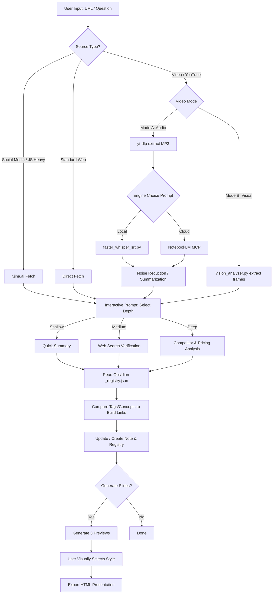
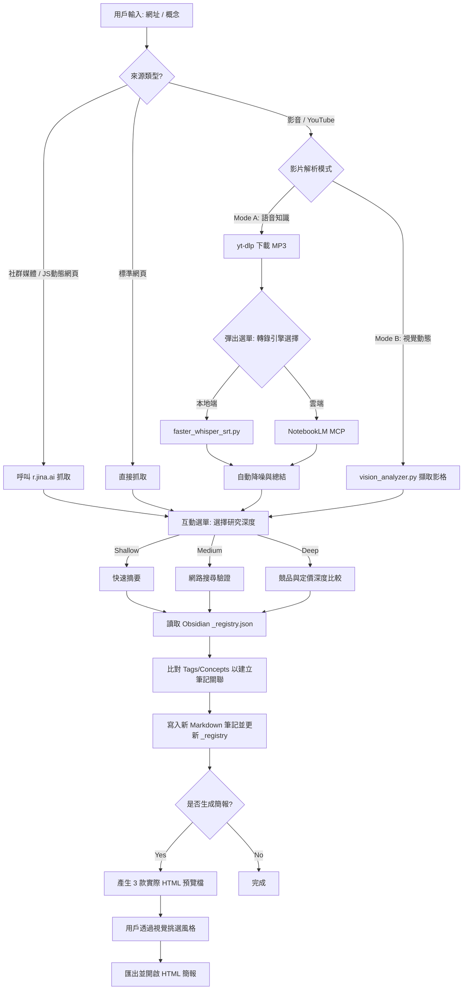

# AI Knowledge Base (Agent Skill)

[English](#english) | [繁體中文](#繁體中文) | [🔴 Live Demo](https://allenphant.github.io/ai-knowledge-base-skill/demo/ai-knowledge-base-skill-presentation.html)

---

<a name="english"></a>
# 🇬🇧 English Documentation

> **[🔴 Live Demo](https://allenphant.github.io/ai-knowledge-base-skill/demo/ai-knowledge-base-skill-presentation.html)** — An actual output generated by this skill: a deep-dive research presentation on this repo itself.

An advanced "Cognitive Accumulation" skill for **AI Agent CLIs (Compatible with both Gemini CLI & Claude Code)**. It is designed to ingest AI tools, URLs, social media posts, and YouTube videos, synthesize them with your existing knowledge, and seamlessly build an automated, token-efficient Obsidian vault. It can also transform this knowledge into beautiful, animation-rich HTML presentations.

## 🚀 Features
1. **Token-Efficient Knowledge Graph**: Uses a lightweight `_registry.json` pattern to search and link your Obsidian notes without passing your entire vault to the LLM. You don't just dump files; you slowly build an interconnected, evolving brain.
2. **Interactive Depth Scaling (Shallow / Medium / Deep)**:
   The skill actively asks you how deep it should research via interactive menus:
   - **Shallow**: A quick 100-line summary based *only* on the provided URL and existing notes. Perfect for "Just tell me what this link is about."
   - **Medium**: Fetches the URL *and* performs web searches to verify claims and find counterpoints.
   - **Deep**: The ultimate analysis. Actively searches for competitors, compares pricing, checks GitHub stars, and builds a comprehensive comparison table.
3. **Dual-Mode Video Analysis**:
   - **Mode A (Knowledge-Centric)**: Transcribes video audio using locally bundled `faster-whisper-srt` or cloud-based NotebookLM MCP.
   - **Mode B (Visual-Centric)**: Analyzes video frames via bundled `vision_analyzer.py`.
4. **Subagent Delegation**: Intelligently delegates long transcript summarization to subagents (if supported by your CLI) to keep the main context window clean.
5. **Frontend Slides Integration**: Seamlessly generates standalone, zero-dependency HTML presentations through a "Show, Don't Tell" visual discovery process.

## 📦 What's Included vs. What You Need to Install

**Included in this NPM Package (`npm install -g agent-skill-ai-knowledge-base`):**
- The core `instructions.md` and `SKILL.md` logic.
- An automatic install script that configures absolute paths and installs the skill into both your `~/.gemini/skills/` and `~/.claude/skills/` directories.
- Bundled Python scripts: `vision_analyzer.py` and `faster_whisper_srt.py`.
- Bundled `frontend-slides` CSS/HTML templates and export scripts.

**⚠️ User Required Installations (Manual Setup):**
If you do not install the following, the core Markdown extraction and Obsidian linking will still work, but **Video processing (Mode A / Mode B)** will fail.

1. **Python 3.10+ & FFmpeg**: Required for audio/video extraction. Must be in your system PATH.
2. **Install Python Dependencies**: 
   Navigate to the installed skill directory (or the repo root) and run:
   ```bash
   pip install -r requirements.txt
   ```
   *(This installs `yt-dlp`, `faster-whisper`, `opencv-python`, and `python-pptx`)*
3. **NotebookLM MCP (Optional)**: 
   If you want Google's high-context reasoning instead of Local Whisper, you must configure the NotebookLM MCP server.
   - **Step 1**: Ensure you have a running MCP server that connects to NotebookLM.
   - **Step 2**: Add the MCP server configuration to your Agent CLI config file (e.g., `~/.gemini/config.json` for Gemini CLI or the respective Claude Code config).
   - **Step 3**: When the agent asks for your engine choice via the interactive menu, simply select "NotebookLM" and it will route the audio/transcript to your configured MCP tool.

## 🔄 Workflow Pipeline



## 🛠️ Usage & Trigger Phrases

Both **Gemini CLI** and **Claude Code** support two ways to activate this skill:

| Method | How |
|--------|-----|
| **Manual trigger** | Type `/ai-knowledge-base` in your CLI |
| **Semantic auto-trigger** | Just paste a URL or describe a research task — the agent detects the intent and activates automatically |

**Trigger Examples:**
- *"Can you analyze this NotebookLM tutorial? [YouTube URL]"*
- *"Add this to my knowledge base: [Threads URL]"*
- *"Compare LangChain and CrewAI based on my existing notes."*
- *"Read this GitHub repo and make a deep dive note: [GitHub URL]"*

## 💬 Interactive Q&A — What to Expect After You Send a Request

Once triggered, the agent guides you through a short decision sequence **before** it starts working. Here's a map of every question you might be asked:

### Stage 1 — Core Configuration (asked every time)

| Question | Options | What It Controls |
|----------|---------|-----------------|
| **Depth** | `Shallow` / `Medium` / `Deep` | How exhaustively the agent researches the topic |
| **Compare** | `Yes` / `No` | Whether to compare against tools/concepts already in your vault |
| **Vault** | `Yes` / `No` | Whether to save a permanent Obsidian note |
| **Slides** | `Yes` / `No` | Whether to generate an HTML presentation from the findings |

**Depth explained:**
- **Shallow** — reads only the URL you provided + your existing notes. Fast, minimal tokens. Best for *"just tell me what this is."*
- **Medium** — fetches the URL, then runs web searches to verify claims and find counterpoints.
- **Deep** — full competitive analysis: searches for rivals, compares pricing, checks GitHub stars, and builds a comparison table.

### Stage 2 — Video-Specific (only if input is a video URL)

| Question | Options | What It Controls |
|----------|---------|-----------------|
| **Analysis Flavor** | `Knowledge (Text)` / `Visual (Scenes)` | Mode A vs. Mode B |
| **Transcription Engine** *(Mode A only)* | `NotebookLM (Cloud)` / `Local Whisper` | Where the audio is transcribed |

- **Knowledge / Mode A** — transcribes the audio for a full semantic note. Use this for lectures, tutorials, and talks.
- **Visual / Mode B** — extracts video frames for scene and action analysis. Use this for demos, UI walkthroughs, and design videos.
- **NotebookLM** — routes to your configured MCP server (cloud, high-context).
- **Local Whisper** — runs `faster_whisper_srt.py` fully offline (privacy-safe).

### Stage 3 — Slides Sub-Configuration (only if Slides = Yes)

| Question | What to Provide |
|----------|----------------|
| **Purpose** | Who will see this? (e.g., team demo, personal reference, client pitch) |
| **Length** | Approximate number of slides |
| **Mood / Vibe** | e.g., Professional, Creative, Calm, Inspired |

After answering, the agent generates **3 live HTML previews** and opens them in your browser — you pick the one you like before the final version is built.

## 🙏 Acknowledgments

This skill heavily utilizes the incredible presentation logic from the **[frontend-slides](https://github.com/zarazhangrui/frontend-slides)** repository created by Zara Zhang. 
*Note on Open Source Etiquette: The HTML templates, CSS (`viewport-base.css`), and deployment scripts from `frontend-slides` have been bundled into this package to ensure a zero-dependency, out-of-the-box experience. All original design philosophies and credit belong to the original author.*

---

<br><br>

<a name="繁體中文"></a>
# 🇹🇼 繁體中文說明文件

> **[🔴 實際成果展示](https://allenphant.github.io/ai-knowledge-base-skill/demo/ai-knowledge-base-skill-presentation.html)** — 這份簡報就是用本 Skill 對自身 Repo 進行深度研究後產生的真實輸出。

這是一個專為 **AI Agent CLIs (完美相容 Gemini CLI 與 Claude Code)** 設計的高階「知識累積」Skill。它可以接收 AI 工具、網址、社群貼文與 YouTube 影片，將其與你現有的知識進行融合，並自動建立一個極度節省 Token 的 Obsidian 知識庫。它還能將這些知識轉換為精美且包含動畫效果的 HTML 簡報。

## 🚀 核心功能
1. **Token 極簡知識圖譜**：使用輕量級的 `_registry.json` 來搜尋與關聯 Obsidian 筆記，無需將整個知識庫塞入 LLM 的 Context。你不是在單純存檔，而是在慢慢建立一個網狀連結的「第二大腦」。
2. **互動式的研究深度選擇 (Shallow / Medium / Deep)**：
   在處理資料時，Agent 會透過選單主動詢問你希望的研究深度：
   - **Shallow (淺層)**：僅基於你提供的網址與現有筆記，產出 100 行以內的快速摘要。適合「幫我看一下這個網址在幹嘛」。
   - **Medium (中層)**：讀取網址後，會額外進行網路搜尋來驗證其說法並尋找反面觀點。
   - **Deep (深層)**：終極的深度分析。Agent 會主動搜尋競品、比較定價、檢查開源生態系 (如 GitHub Stars)，並為你建立完整的競品比較表。
3. **雙模式影片分析**：
   - **Mode A (知識深度型)**：使用內建的 `faster-whisper-srt` 或雲端 NotebookLM MCP 將影片轉錄為精準逐字稿。
   - **Mode B (視覺動態型)**：使用內建的 `vision_analyzer.py` 擷取影片關鍵影格。
4. **Subagent 智能委派**：自動將數萬字的長篇字幕丟給子代理人 (若你的 CLI 支援此架構) 進行降噪與總結，確保主 Agent 的記憶體保持乾淨高效。
5. **Frontend Slides 完美整合**：透過「視覺預覽、不盲選」的互動流程，無縫生成零依賴、支援網頁內建編輯的 HTML 簡報檔。

## 📦 NPM 套件包含了什麼？你還需要安裝什麼？

**本 NPM 套件內建包含 (`npm install -g agent-skill-ai-knowledge-base`)：**
- 核心的 `instructions.md` 與 `SKILL.md` 邏輯。
- 一支會在安裝時自動將技能分發到你的 `~/.gemini/skills/` 與 `~/.claude/skills/` 且替換正確絕對路徑的 `install.js`。
- 打包好的 Python 腳本：`vision_analyzer.py` 與 `faster_whisper_srt.py`。
- 打包好的 `frontend-slides` CSS/HTML 模板與匯出腳本。

**⚠️ 用戶需要「手動」安裝的前置作業：**
如果你沒有安裝以下套件，純文字網頁抓取與 Obsidian 建檔依然可以運作，但 **影片處理 (Mode A / Mode B)** 會直接報錯失敗。

1. **Python 3.10+ 與 FFmpeg**：處理影音必備，且必須加入系統 PATH 變數。
2. **安裝 Python 依賴套件**：
   請導航至本套件的安裝目錄，並執行以下指令一次安裝所有需要的 Python 模組：
   ```bash
   pip install -r requirements.txt
   ```
   *(這將會為你安裝 `yt-dlp`, `faster-whisper`, `opencv-python` 以及 `python-pptx`)*
3. **設定 NotebookLM MCP (選用)**：
   如果你希望使用 Google 強大的高語境推理來取代本地端的 Whisper 轉錄，你必須先設定好 NotebookLM MCP 伺服器：
   - **步驟 1**：確保你有一個正在運作且已串接 NotebookLM 的 MCP Server。
   - **步驟 2**：將該 MCP Server 的連線設定加入你的 Agent CLI 設定檔中 (例如 Gemini CLI 的 `~/.gemini/config.json` 或 Claude Code 對應的設定位置)。
   - **步驟 3**：當你傳送影片網址並觸發 Mode A 時，Agent 會彈出互動選單問你要用哪個引擎，此時選擇「NotebookLM」即可。

## 🔄 系統處理流程 (SOP)



## 🛠️ 如何觸發與使用 (Usage)

**Gemini CLI** 與 **Claude Code** 都支援兩種啟動方式：

| 啟動方式 | 操作 |
|---------|------|
| **手動觸發** | 在 CLI 中輸入 `/ai-knowledge-base` |
| **語意自動觸發** | 直接貼上網址或描述研究需求，Agent 偵測到意圖後自動啟動 |

**觸發語句範例：**
- *"幫我把這個 NotebookLM 教學存進知識庫：[YouTube 網址]"*
- *"這篇 Threads 在講什麼？幫我建檔：[Threads 網址]"*
- *"根據我現有的筆記，比較 LangChain 跟 CrewAI 的優缺點。"*
- *"幫我深度分析這個 GitHub Repo 的原始碼架構：[GitHub 網址]"*

## 💬 觸發後的互動問答 — Agent 會問你什麼？

送出請求後，Agent 會在開始處理前引導你完成一段決策流程。以下是所有可能出現的問題完整對照表：

### 第一階段 — 核心設定（每次都會問）

| 問題 | 選項 | 控制的功能 |
|------|------|-----------|
| **研究深度 (Depth)** | `Shallow` / `Medium` / `Deep` | Agent 挖掘資料的廣度與深度 |
| **比較分析 (Compare)** | `Yes` / `No` | 是否與知識庫中已有的工具或概念進行對比 |
| **存入知識庫 (Vault)** | `Yes` / `No` | 是否將結果存為 Obsidian Markdown 筆記 |
| **生成簡報 (Slides)** | `Yes` / `No` | 是否將研究成果轉為 HTML 簡報 |

**深度選項說明：**
- **Shallow（淺層）** — 僅讀取你提供的網址 + 現有筆記。速度最快、Token 消耗最低。適合「快速告訴我這是什麼」。
- **Medium（中層）** — 讀取網址後，額外進行網路搜尋以驗證說法並尋找反面觀點。
- **Deep（深層）** — 完整競品分析：主動搜尋競爭對手、比較定價、查詢 GitHub Stars，並建立完整比較表。

### 第二階段 — 影片專屬（僅當輸入來源為影片網址時）

| 問題 | 選項 | 控制的功能 |
|------|------|-----------|
| **分析方式** | `Knowledge (知識/語音)` / `Visual (視覺/畫面)` | Mode A 或 Mode B |
| **轉錄引擎** *（僅 Mode A）* | `NotebookLM (雲端)` / `Local Whisper (本地)` | 語音轉文字的處理位置 |

- **Knowledge / Mode A** — 轉錄影片音訊，生成完整語意筆記。適合講座、教學、演講類影片。
- **Visual / Mode B** — 擷取影片畫格，分析畫面動作與視覺內容。適合操作示範、UI Walkthrough、設計類影片。
- **NotebookLM** — 轉交給你設定好的 MCP Server 處理（雲端、高語境推理）。
- **Local Whisper** — 在本地端執行 `faster_whisper_srt.py`，完全離線，保護隱私。

### 第三階段 — 簡報子設定（僅當 Slides = Yes 時）

| 問題 | 填寫內容 |
|------|---------|
| **目的 (Purpose)** | 這份簡報給誰看？（例：團隊展示、個人備忘、客戶提案） |
| **長度 (Length)** | 預計約幾頁投影片 |
| **風格感受 (Mood / Vibe)** | 例：Professional（專業）、Creative（創意）、Calm（沉穩）、Inspired（激勵） |

回答完畢後，Agent 會立即生成 **3 個可實際預覽的 HTML 檔案**並在瀏覽器中開啟——你親眼看過、選定喜歡的風格後，才會輸出最終版本。

## 🙏 鳴謝與開源聲明

本 Skill 在簡報生成階段，深度整合了由 Zara Zhang 所開發的極致美學專案 **[frontend-slides](https://github.com/zarazhangrui/frontend-slides)**。
*開源運作說明：為了讓用戶能夠透過 npm「開箱即用」而無需手動 clone 其他專案，本套件將 `frontend-slides` 的 HTML 模板、`viewport-base.css` 與部署腳本直接打包進了安裝包中。所有關於簡報的美學設計理念與架構歸功於原作者。*